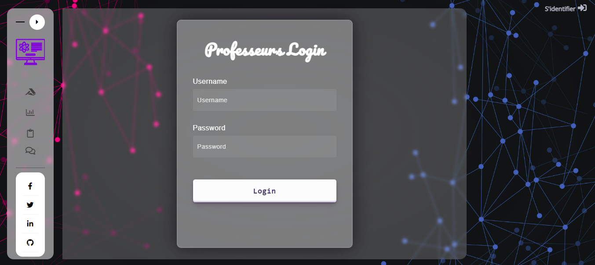
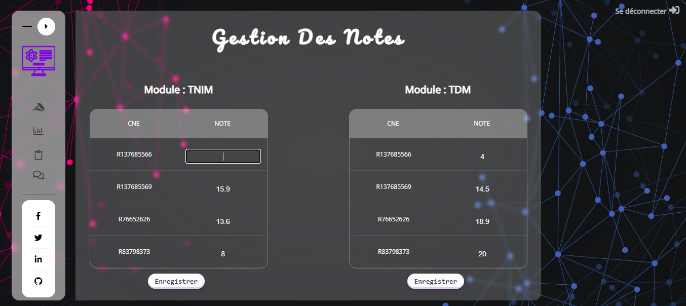
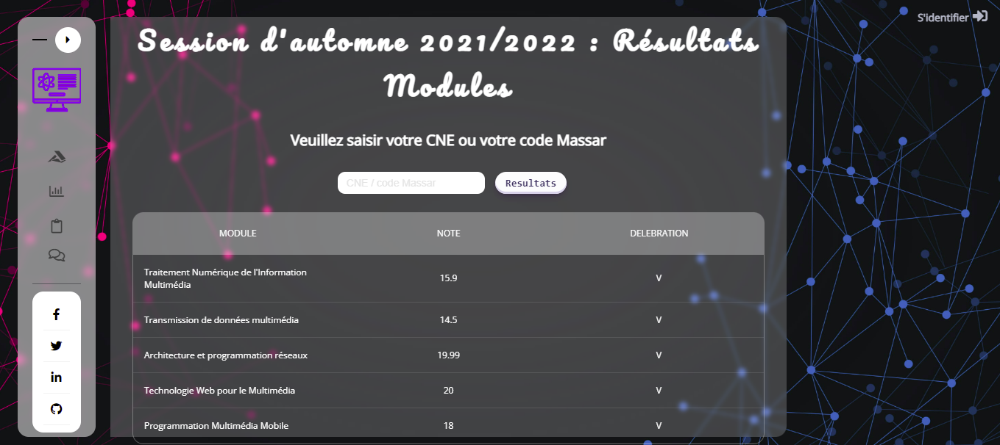
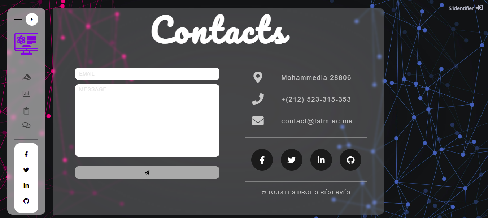

# Student-Result-Management-System
Student Results Management System Website using HTML, CSS, JS, PHP and MySQL.

* Interface 1 : Index   

* Interface 2 : Profs Authentication Page   

* Interface 3 : Profs Marks Management Page   

* Interface 4 : Students Results Page   

* Interface 5 : Contact Page   

